# Job Portal for Students
A Job Portal for Students built with Django that helps students find jobs and connect with potential employers.

## Features
###  Students
- **Browse Jobs** - Explore all available jobs in the portal
- **View Job Details** – Check job details in either full page or a quick side panel view
- **Apply for Jobs** – Submit applications directly through the portal
- **Save Jobs** – Bookmark interesting job posts to revisit later
- **View Saved Jobs** – Access all saved jobs in one place
- **Track Applications** – View the list of jobs you’ve applied for and monitor application status

### Employers
- **Create Job Listings** – Create new job listings
- **Edit or Delete Jobs** – Manage job posts
- **Toggle Job Status** – Mark jobs as active or closed
- **View My Jobs** – See all job listings created
- **View Applications** – Review all student applications for each job
- **Accept or Reject Applications** – Manage applicants and update their statuses

## Tech Stack
- [Django](https://www.djangoproject.com/) – Backend framework
- [HTML/CSS](https://developer.mozilla.org/en-US/docs/Web) / [Bootstrap](https://getbootstrap.com/) – Frontend
- [TinyMCE](https://www.tiny.cloud/) – Rich text editor for job descriptions
- [SQLite](https://www.sqlite.org/index.html) – Default Django database


## Screenshots
### Landing Page
| Hero | Featured Jobs | Footer |
| --- | --- | --- |
|  | 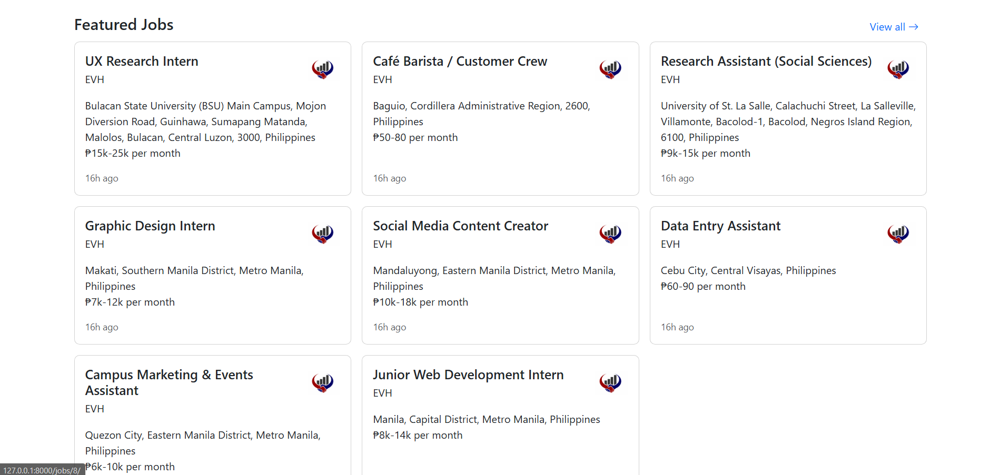 |  |

### Student Page

| Job List | Job Detail | Apply Job |
| --- | --- | --- |
| 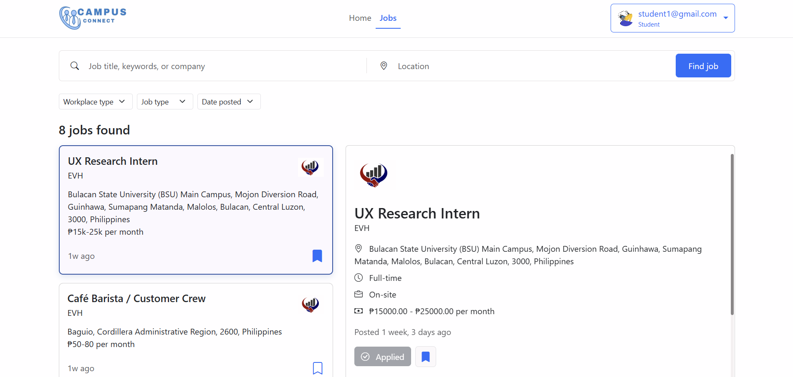 | 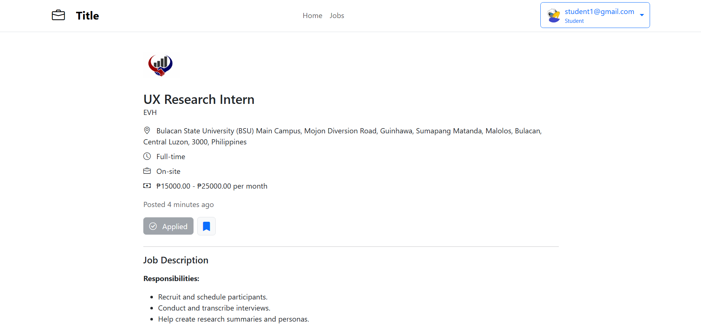 | 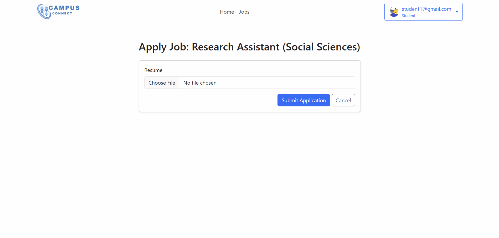 |

| View Saved Jobs | Track Applications | Profile |
| --- | --- | --- |
| 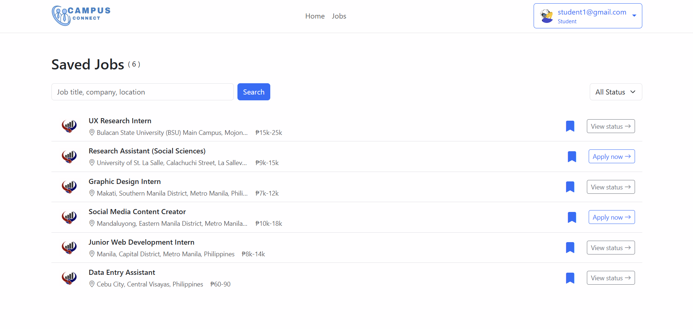 | 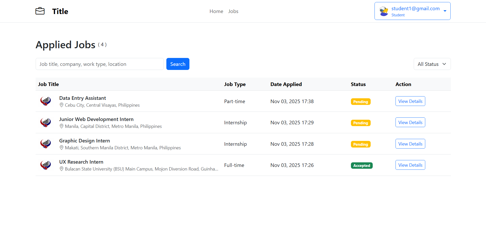 | 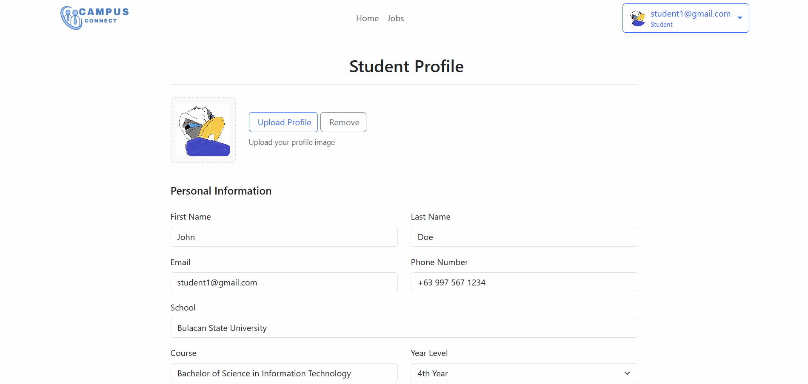 |

### Employer Page

| Create Job | Manage Jobs |
| --- | --- |
| 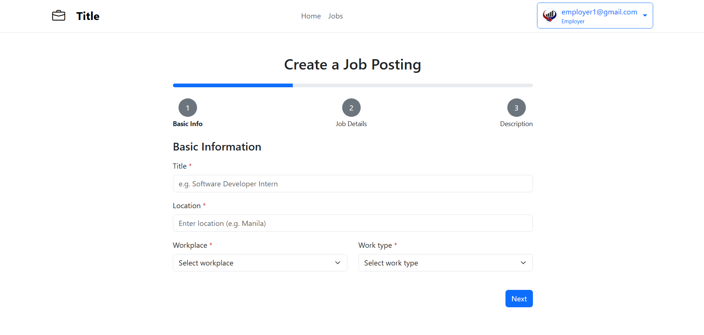 | 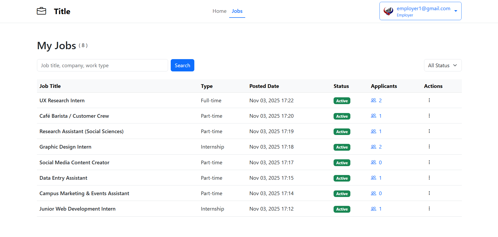 |

| Manage Applications | Profile |
| --- | --- |
| 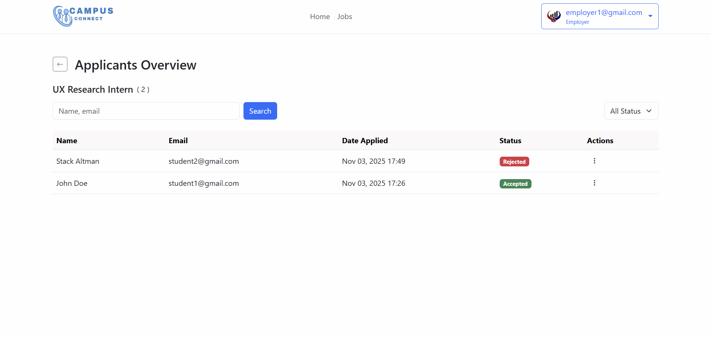 | 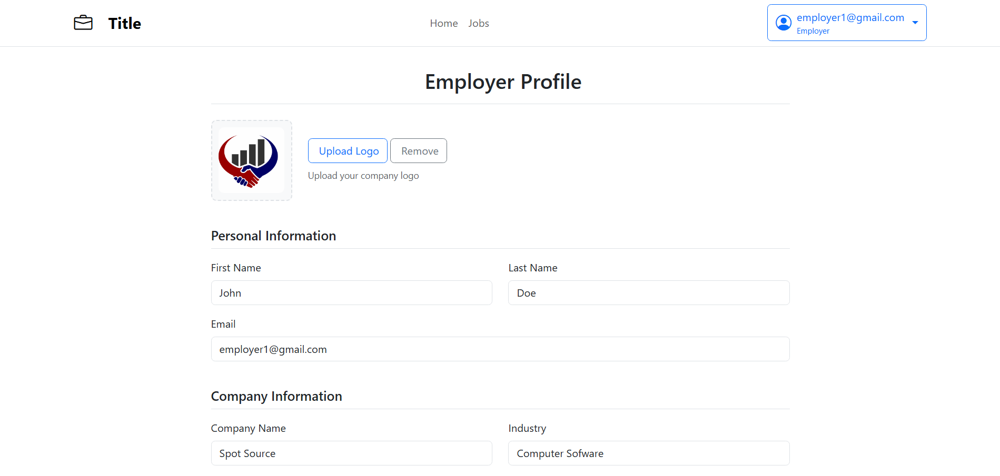 |


## Getting Started

1. **Clone the repository**
   ```bash
   git clone https://github.com/alexgalicio/jobportal.git
   cd jobportal
   ```

2. **Create virtual environment**
   ```bash
   python -m venv venv
   ```

   Activate it:
   * Windows:
      ```bash
      venv\Scripts\activate
      ```
   * macOS/Linux:
      ```bash
      source venv/bin/activate
      ```

3. **Install dependencies**
   ```bash
   pip install -r requirements.txt
   ```

4. **Run migrations**
   ```bash
   python manage.py makemigrations
   python manage.py migrate
   ```

5. **Create superuser (optional)**
   ```bash
   python manage.py createsuperuser
   ```

6. **Start the development server**
   ```bash
   python manage.py runserver
   ```

 Open `http://127.0.0.1:8000/` with your browser to see the result.